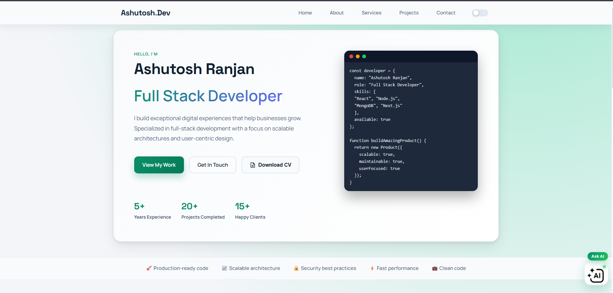
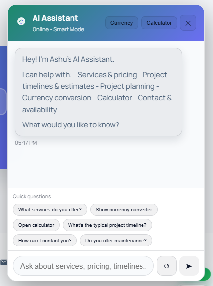
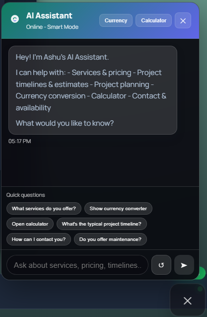
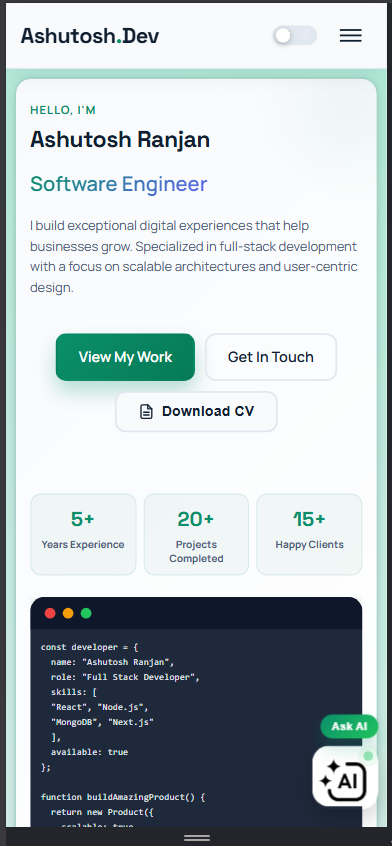
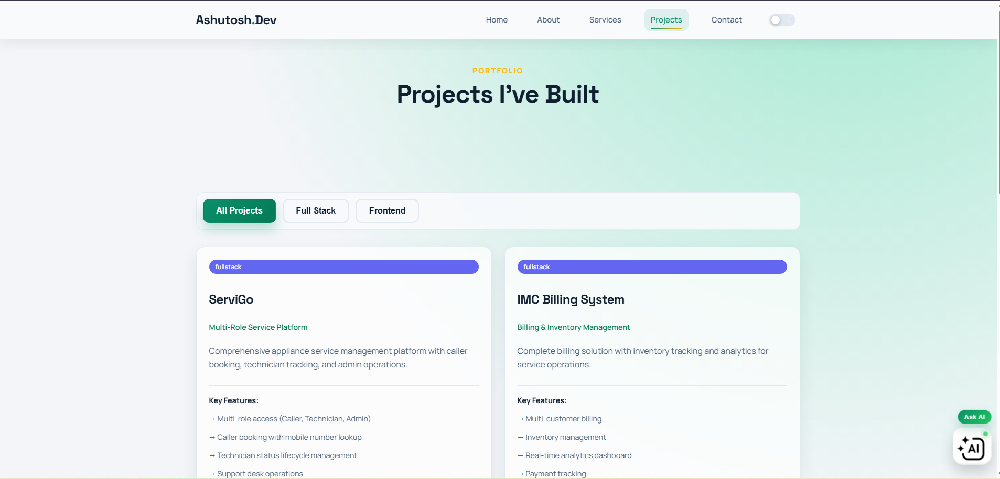
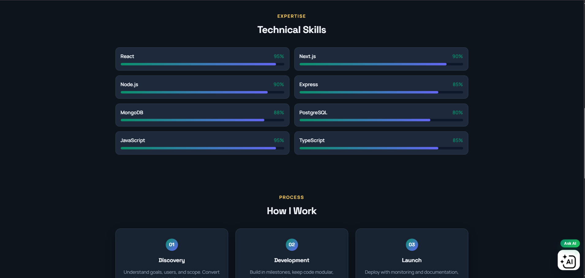
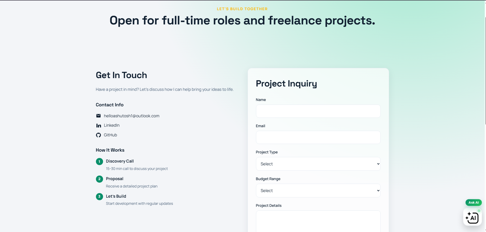

.png)

# Ashutosh Ranjan Portfolio

## Overview
Full‑stack portfolio website.

## Tech Stack
- Frontend: Next.js (React)
- Backend: Node.js + Express
- Database: MongoDB (Mongoose)

## Local Setup
Frontend:
```
cd frontend
npm install
npm run dev
```

Backend:
```
cd backend
npm install
npm run dev
```

## Production (Vercel + Render + MongoDB Atlas)
Frontend (Vercel):
- `NEXT_PUBLIC_API_URL`
- `NEXT_PUBLIC_SITE_URL`

Backend (Render):
- `NODE_ENV=production`
- `MONGODB_URI`
- `ADMIN_EMAIL`
- `ADMIN_PASSWORD`
- `ALLOWED_ORIGIN`
- `FRONTEND_URL`

Health check:
```
/health
```

## Resume
Place the latest file here:
```
frontend/public/resume.pdf
```

## 📸 Screenshots

### 🏠 Home Page


### 🌗 Dark Mode
.png)

### 🤖 AI Assistant (Light)


### 🤖 AI Assistant (Dark)


### 📱 Mobile View


### 📄 Projects Section


### 🛠️ Technical Skills 


### 📬 Contact Section

